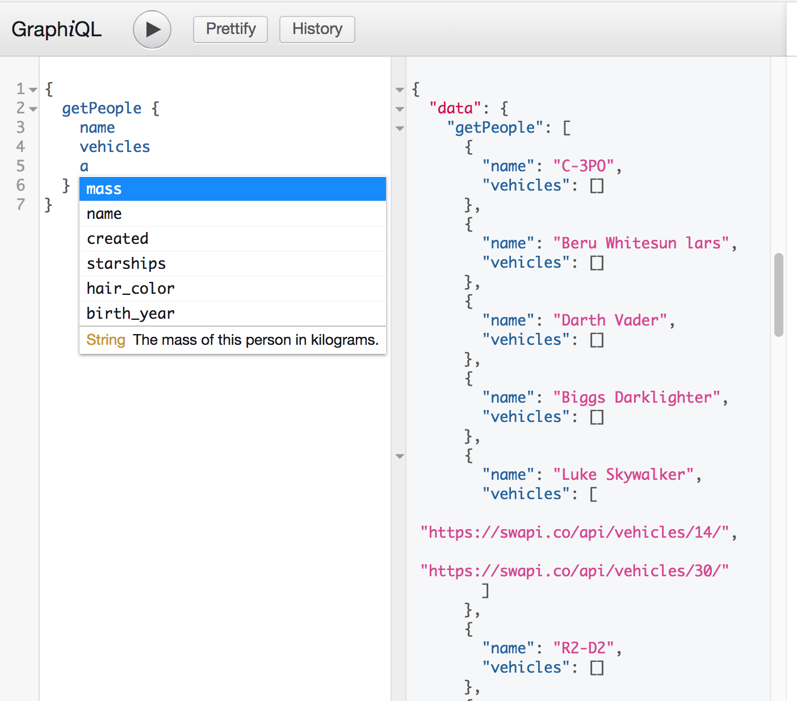

# Step2: Real data, resolvers and schemas

In this step, we'll go through basic concepts called _resolvers, schemas and graphql_

## 1. Resolvers

Resolvers are simply hooks to fill in the GraphQL type system. A resolver is actual code implementation that will get the data from a db or another api.

A resolver can be a function or a Promise, so it works well in an async way to get data from a db for example to one part of the query and fill another part from an external API.

In this step, we have a _peopleResolver_ which is simply returning all documents of the People collection in db.

## 2. Schema

GraphQL has a different schema than the one we have with database. This is good for a couple of reasons. This allows you to rethink your API and do simple computations for example and not to expose the db schema to outsiders.

A GraphQL People schema in this step is defined in /schema/graphQLSchema

## 3. Setup.

`npm install`

Modify the following lines in the .env file, using your own MongoDB values:

```
DB_USER=youruser

DB_PASS=yourpass

DB_HOST=yourhost:andport/dbname
```

## 3. At the end of this step, you should have a working GraphQL api to retrieve Persons from the mongo db.

`npm start`

Open localhost:3000/graphiql

Run a test query like 
{
    getPeople
}


